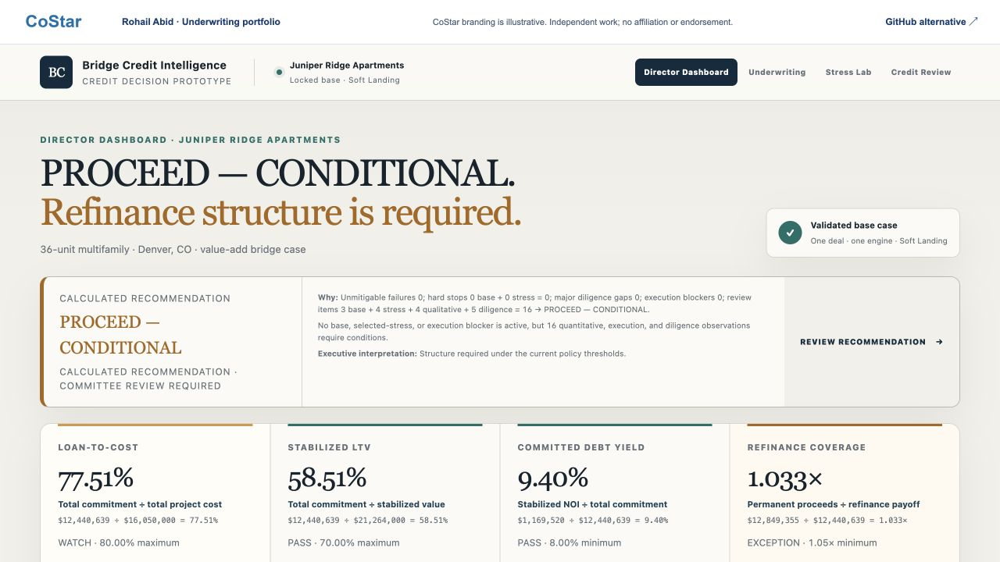

# Bridge Credit Intelligence

A multifamily credit case with an underwriting engine, explicit policy tests, stress scenarios and human review.

[Open the live project](https://costar.rohailabid.com/projects/bridge/) · [Portfolio overview](https://costar.rohailabid.com/) · [Download the local demo pack](costar-demo-pack.zip)

## Review path

1. Open the Director Dashboard and read the calculated recommendation.
2. Use Underwriting to change an assumption and inspect the formula, substituted inputs and result.
3. Open Stress Lab and select a downside scenario.
4. Open Credit Review to inspect exceptions, conditions and the separate human review.

## Product relevance

Shows how CRE underwriting judgment becomes defaults, thresholds, evidence and a review workflow.

## Review context

Independent work by Rohail Abid. CoStar branding is illustrative and does not imply affiliation or endorsement. Working demos use fictitious data. Uploaded workbooks and entered financial data are not sent to an application backend.
