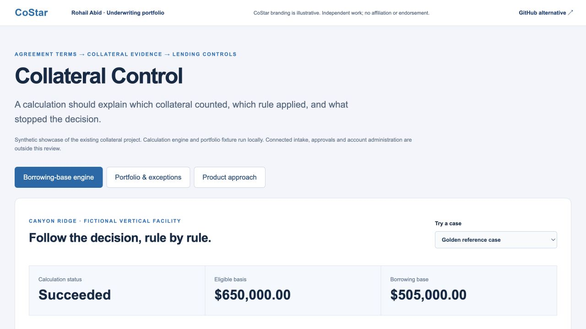

# Collateral Control

A self-contained synthetic showcase of the collateral project’s existing agreement engine and portfolio fixture. No login or connected borrower system is needed.

[Open the live project](https://costar.rohailabid.com/projects/collateral/) · [Portfolio overview](https://costar.rohailabid.com/) · [Download the local demo pack](costar-demo-pack.zip)

## Review path

1. The golden reference case produces a $505,000 borrowing base from a $650,000 eligible basis.
2. Reduce the spec advance from 75% to 65%; the borrowing base becomes $475,000.
3. Remove required cost evidence or select an unapproved rule version; the calculation blocks.
4. Replay a calculation and inspect the rule trace and fingerprint.
5. Open Portfolio & exceptions to explore 16 borrowers, 40 facilities, 120 projects and 2,400 fictional units.

## Product relevance

Shows agreement configuration, deterministic calculations, stable collateral identities, source conflicts and operational controls. Connected intake, live approvals, release/payoff execution and account administration are outside this showcase.

## Review context

Independent work by Rohail Abid. CoStar branding is illustrative and does not imply affiliation or endorsement. Working demos use fictitious data. Uploaded workbooks and entered financial data are not sent to an application backend.
