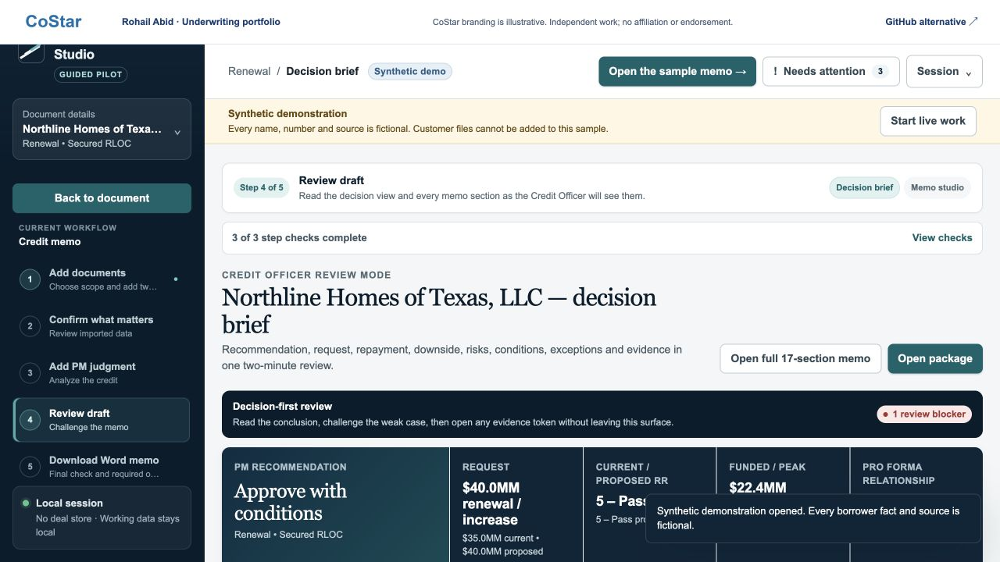

# Credit Decision Studio

A local credit drafting workspace that combines a structured document, source analysis, PM-authored judgment and Word output.

[Open the live project](https://costar.rohailabid.com/projects/credit/) · [Portfolio overview](https://costar.rohailabid.com/) · [Download the local demo pack](costar-demo-pack.zip)

## Review path

1. Select Explore synthetic demo for a fictional populated example.
2. Open the sample memo and explore the document structure.
3. Use Sources & analysis to see how evidence is kept distinct from authored judgment.
4. Review the document and use Download Word. Blank memo and quarterly review workflows are also available.

## Product relevance

Shows practical workflow design around the lender’s deliverable, with evidence and judgment kept explicit.

## Review context

Independent work by Rohail Abid. CoStar branding is illustrative and does not imply affiliation or endorsement. Working demos use fictitious data. Uploaded workbooks and entered financial data are not sent to an application backend.
