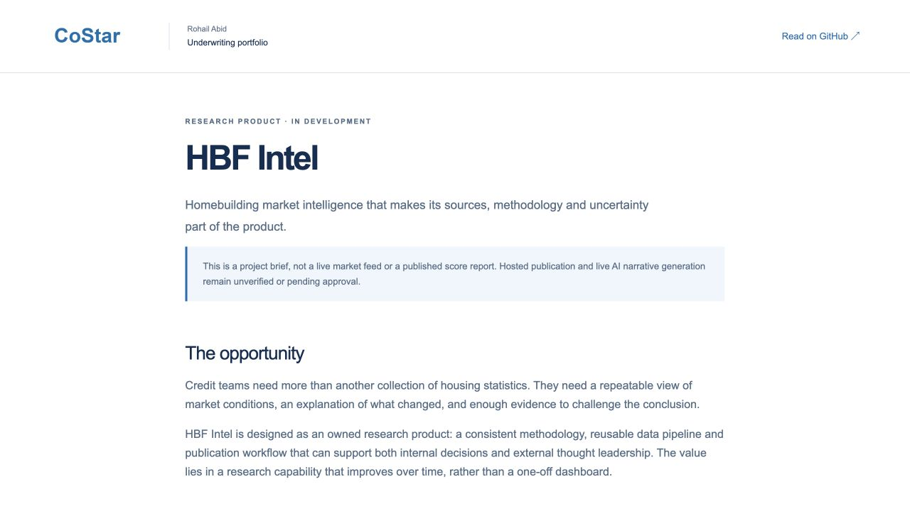

# HBF Intel

A homebuilding market-intelligence research product in development, described here as a project brief.

[Open the live project](https://costar.rohailabid.com/projects/intel/) · [Portfolio overview](https://costar.rohailabid.com/) · [Download the local demo pack](costar-demo-pack.zip)

## Review path

1. Read the opportunity and development status in the project brief.
2. Review the source-provenance, repeatable-methodology, historical-validation and publication-control approach.
3. Consider how the research process could support internal underwriting and external thought leadership.

## Product relevance

Shows research-product thinking and a reusable analytical capability. This is not a published market feed or score report. Live AI narratives and hosted publication are not represented as verified working capabilities.

## Review context

Independent work by Rohail Abid. CoStar branding is illustrative and does not imply affiliation or endorsement. Working demos use fictitious data. Uploaded workbooks and entered financial data are not sent to an application backend.
