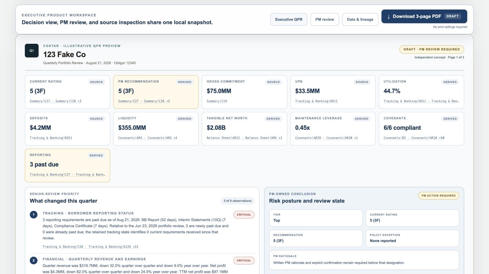

# QPR Intelligence

A recurring review workflow that turns a structured homebuilder monitor into an executive QPR with source lineage and PDF output.

[Open the live project](https://costar.rohailabid.com/projects/qpr/) · [Portfolio overview](https://costar.rohailabid.com/) · [Download the local demo pack](costar-demo-pack.zip)

## Review path

1. Select Open Demo Relationship; no workbook is required.
2. Open Executive QPR to see the fictitious 123 Fake Co relationship.
3. Select a workbook source beside a metric to inspect the supporting evidence.
4. Review the PM narrative controls and Download 3-page PDF. The output stays marked draft until the review requirements are satisfied.

## Product relevance

Shows portfolio surveillance, data normalization, materiality, provenance and the boundary between factual drafting and credit judgment.

## Review context

Independent work by Rohail Abid. CoStar branding is illustrative and does not imply affiliation or endorsement. Working demos use fictitious data. Uploaded workbooks and entered financial data are not sent to an application backend.
