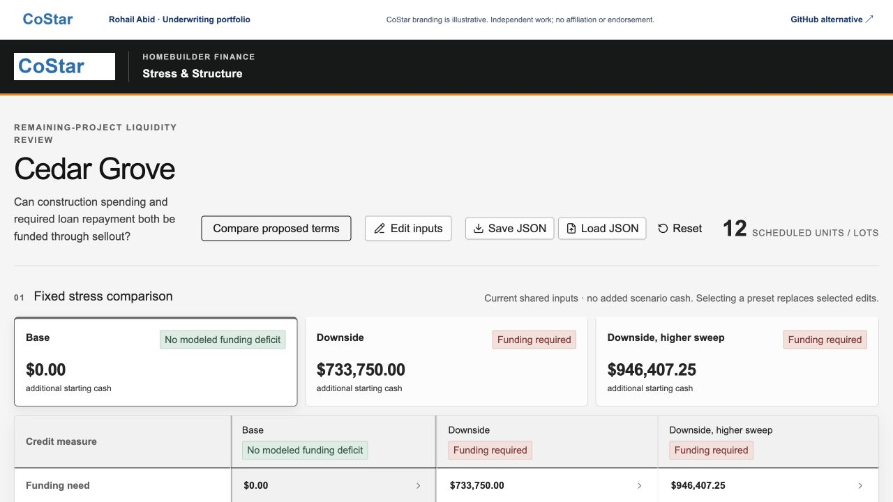

# Loan Structure Lab

A monthly scenario model for homebuilder lending that connects construction spending, sellout, required repayment and liquidity.

[Open the live project](https://costar.rohailabid.com/projects/structure/) · [Portfolio overview](https://costar.rohailabid.com/) · [Download the local demo pack](costar-demo-pack.zip)

## Review path

1. Compare Base, Downside and Downside with a higher sweep.
2. Change price reduction, remaining costs or closing delay.
3. Inspect funding need and the month in which cash becomes constrained.
4. Explore proposed terms and the supporting monthly detail.

## Product relevance

Shows transparent calculations, scenario comparisons and how a structure changes repayment and liquidity risk.

## Review context

Independent work by Rohail Abid. CoStar branding is illustrative and does not imply affiliation or endorsement. Working demos use fictitious data. Uploaded workbooks and entered financial data are not sent to an application backend.
